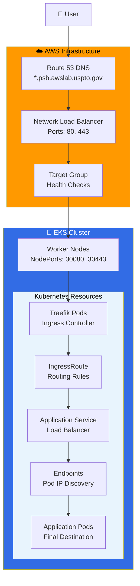

# EKS with Traefik Request Flow

This diagram illustrates how a user request travels through AWS infrastructure to reach application pods in an EKS cluster using Traefik as the ingress controller.

## Key Components Explained

### AWS Infrastructure Layer
- **Route 53**: AWS DNS service that resolves domain names (*.psb.awslab.uspto.gov) to the load balancer IP
- **Network Load Balancer (NLB)**: Layer 4 load balancer that distributes incoming traffic across multiple targets
- **Target Group**: Defines which worker nodes receive traffic and performs health checks

### EKS Cluster Layer
- **Worker Nodes**: EC2 instances running Kubernetes that host your application pods
- **NodePorts (30080, 30443)**: Special ports on each worker node that allow external traffic to reach services inside the cluster

### Kubernetes Resources
- **Traefik Pods**: The ingress controller that acts as a reverse proxy and load balancer inside your cluster
- **IngressRoute**: Custom Traefik resource that defines routing rules (which domain/path goes to which service)
- **Application Service**: Kubernetes abstraction that provides a stable network endpoint for a set of pods
- **Endpoints**: Automatically managed list of pod IPs that the service can route traffic to
- **Application Pods**: The actual containers running your application code

## Request Flow Summary

1. **DNS Resolution**: User makes a request to your domain, Route 53 returns the NLB IP address
2. **Load Balancing**: NLB receives the request and forwards it to a healthy worker node
3. **Node Entry**: Traffic enters the worker node through the NodePort (30080 or 30443)
4. **Ingress Processing**: Traefik pod processes the request based on IngressRoute rules
5. **Service Routing**: Request is forwarded to the appropriate Kubernetes service
6. **Pod Selection**: Service uses endpoints to route traffic to a healthy application pod
7. **Response**: Application pod processes the request and sends response back through the same path

This architecture provides high availability, scalability, and easy management of containerized applications in AWS EKS.
