# USPTO Observability Stack Recommendation

## 🏛️ Recommended: Enhanced CloudWatch-Centric Stack

```mermaid
flowchart TD
    subgraph EKS["🎯 USPTO EKS Clusters"]
        subgraph APPS["Patent/Trademark Applications"]
            APP1[Patent Search API]
            APP2[Trademark Database]
            APP3[PAIR System]
            APP4[Fee Processing]
        end
        
        ADOT[ADOT Collector<br/>Single Agent<br/>Gov Cloud Compatible]
        
        APPS --> ADOT
    end
    
    subgraph AWS_GOV["☁️ AWS GovCloud Services"]
        CW[CloudWatch<br/>• All Metrics<br/>• Application Logs<br/>• Audit Logs<br/>• Cost Tracking]
        XRAY[X-Ray<br/>• Service Maps<br/>• Performance Traces<br/>• Error Tracking]
    end
    
    subgraph DASHBOARDS["📊 Visualization & Alerts"]
        AMG[Amazon Managed Grafana<br/>• Executive Dashboards<br/>• Operational Views<br/>• Cost Analytics]
        CW_DASH[CloudWatch Dashboards<br/>• Service Health<br/>• SLA Monitoring]
        SNS[SNS Alerts<br/>• PagerDuty Integration<br/>• Email/SMS Notifications]
    end
    
    ADOT -->|All telemetry data| CW
    ADOT -->|Distributed traces| XRAY
    
    AMG -.->|Primary visualization| CW
    AMG -.->|Service topology| XRAY
    CW_DASH -.->|Native dashboards| CW
    
    CW -->|Threshold alerts| SNS
    
    style EKS fill:#326ce5,color:#fff
    style AWS_GOV fill:#ff9900,color:#fff
    style DASHBOARDS fill:#00c851,color:#fff
```



## Why CloudWatch-Centric for USPTO?

### 🏛️ Government-Specific Advantages

**1. Budget Predictability**
- Single service billing (CloudWatch)
- No surprise AMP costs from high-cardinality metrics
- Clear cost allocation per application/department
- Easier budget justification to Congress

**2. Compliance & Security**
- FedRAMP High authorized
- FISMA compliance built-in
- Government cloud regions available
- Native AWS IAM integration
- Audit trail for all observability access

**3. Operational Simplicity**
- Fewer moving parts = lower operational risk
- Standard government contractor skillsets
- AWS Premium Support covers entire stack
- Simplified procurement (single vendor)

**4. Vendor Risk Management**
- Reduced dependency on multiple AWS services
- Less complex contract negotiations
- Easier to migrate if needed
- Standard government AWS pricing

### 🔧 Enhanced Configuration for USPTO

```yaml
# ADOT Collector optimized for government workloads
apiVersion: opentelemetry.io/v1alpha1
kind: OpenTelemetryCollector
metadata:
  name: uspto-observability
  namespace: monitoring
spec:
  config: |
    receivers:
      # Application metrics
      otlp:
        protocols:
          grpc:
            endpoint: 0.0.0.0:4317
      
      # Kubernetes metrics
      k8s_cluster:
        auth_type: serviceAccount
        node: ${K8S_NODE_NAME}
        
      # System metrics
      hostmetrics:
        collection_interval: 60s
        scrapers:
          cpu: {}
          memory: {}
          disk: {}
          network: {}

    processors:
      # Cost optimization
      batch:
        timeout: 30s
        send_batch_size: 512
      
      # Add USPTO-specific labels
      resource:
        attributes:
          - key: government.agency
            value: "USPTO"
            action: insert
          - key: classification
            value: "FOUO"  # For Official Use Only
            action: insert
      
      # Filter sensitive data
      attributes:
        actions:
          - key: user.id
            action: delete
          - key: ssn
            action: delete

    exporters:
      # All metrics to CloudWatch with USPTO namespacing
      awscloudwatch:
        region: us-gov-west-1  # GovCloud
        namespace: USPTO/Applications
        metric_declarations:
          # Patent system metrics
          - dimensions: [[service.name, patent.type]]
            metric_name_selectors:
              - "patent_applications_total"
              - "patent_search_duration"
              - "patent_processing_errors"
          
          # Trademark system metrics  
          - dimensions: [[service.name, trademark.class]]
            metric_name_selectors:
              - "trademark_filings_total"
              - "trademark_search_latency"
          
          # Fee processing metrics
          - dimensions: [[service.name, payment.method]]
            metric_name_selectors:
              - "fee_transactions_total"
              - "payment_processing_time"
      
      # Application logs with compliance
      awscloudwatchlogs:
        region: us-gov-west-1
        log_group_name: /aws/eks/uspto-applications
        log_retention: 2557  # 7 years (government record retention)
      
      # Audit logs separate retention
      awscloudwatchlogs/audit:
        region: us-gov-west-1
        log_group_name: /aws/eks/uspto-audit
        log_retention: 2557  # 7 years compliance
      
      # Distributed tracing
      awsxray:
        region: us-gov-west-1
        no_verify_ssl: false

    service:
      pipelines:
        # Application metrics
        metrics:
          receivers: [otlp, k8s_cluster, hostmetrics]
          processors: [resource, attributes, batch]
          exporters: [awscloudwatch]
        
        # Application logs
        logs/app:
          receivers: [otlp]
          processors: [resource, batch]
          exporters: [awscloudwatchlogs]
        
        # Audit logs (separate pipeline)
        logs/audit:
          receivers: [otlp]
          processors: [resource, batch]
          exporters: [awscloudwatchlogs/audit]
        
        # Distributed traces
        traces:
          receivers: [otlp]
          processors: [resource, batch]
          exporters: [awsxray]
```

## 📊 USPTO-Specific Dashboards

### Executive Dashboard (Amazon Managed Grafana)
```json
{
  "dashboard": {
    "title": "USPTO System Health - Executive View",
    "panels": [
      {
        "title": "Patent Applications Processed Today",
        "type": "stat",
        "targets": [{
          "datasource": "CloudWatch",
          "metricName": "patent_applications_total",
          "namespace": "USPTO/Applications"
        }]
      },
      {
        "title": "System Availability SLA",
        "type": "gauge",
        "targets": [{
          "expression": "100 - (errors/total * 100)",
          "datasource": "CloudWatch"
        }]
      },
      {
        "title": "Fee Revenue Processed",
        "type": "stat",
        "targets": [{
          "metricName": "fee_revenue_total",
          "namespace": "USPTO/Applications"
        }]
      }
    ]
  }
}
```

### Operational Dashboard (CloudWatch Native)
- Service health checks
- Error rates by application
- Response time SLAs
- Infrastructure utilization

## 💰 Cost Analysis for USPTO

### Annual Cost Estimate (Medium Scale)
| Component | Annual Cost | Justification |
|-----------|-------------|---------------|
| **CloudWatch Metrics** | $36,000 | 1M metrics/month @ $0.30/metric |
| **CloudWatch Logs** | $24,000 | 100GB/month @ $0.50/GB |
| **X-Ray Traces** | $12,000 | 2M traces/month @ $5/1M traces |
| **Managed Grafana** | $10,800 | 3 editor licenses @ $9/month |
| **ADOT Compute** | $6,000 | EKS node overhead |
| **Total** | **$88,800** | vs $150K+ for Option 1 |

### Cost Optimizations
```yaml
# Log retention by criticality
log_groups:
  audit_logs: 2557 days    # 7 years (required)
  application_logs: 365 days  # 1 year
  debug_logs: 30 days      # 1 month
  
# Metric sampling for cost control
sampling_rules:
  production: 100%         # All prod metrics
  staging: 50%             # Half of staging
  development: 10%         # Minimal dev metrics
```

## 🚀 Implementation Roadmap

### Phase 1: Foundation (Weeks 1-2)
- Deploy ADOT collector in pilot cluster
- Configure CloudWatch namespaces
- Set up basic dashboards

### Phase 2: Production (Weeks 3-4)
- Roll out to all production clusters
- Configure alerting rules
- Train operations team

### Phase 3: Enhancement (Weeks 5-6)
- Add X-Ray tracing
- Create executive dashboards
- Implement cost controls

### Phase 4: Optimization (Weeks 7-8)
- Fine-tune retention policies
- Optimize metric sampling
- Performance validation

## 🎯 Success Metrics for USPTO

1. **System Reliability**: 99.9% uptime for patent/trademark systems
2. **Performance**: <2s response time for patent searches
3. **Cost Efficiency**: <$100K annual observability spend
4. **Compliance**: 100% audit log retention compliance
5. **User Satisfaction**: <5 minute incident detection time

## Alternative: If Budget Allows Option 1

**Only consider Option 1 if:**
- USPTO modernizes to microservices architecture (50+ services)
- Need advanced PromQL queries for complex analytics
- Have dedicated SRE team with Prometheus expertise
- Congressional appropriation specifically for advanced monitoring

**For most USPTO use cases, CloudWatch-Centric provides:**
✅ 99% of required observability capabilities
✅ 40% lower cost than Option 1
✅ Government compliance out-of-the-box
✅ Operational simplicity for government IT teams
