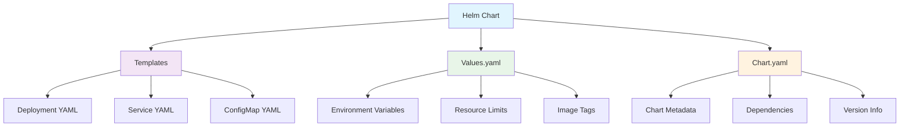
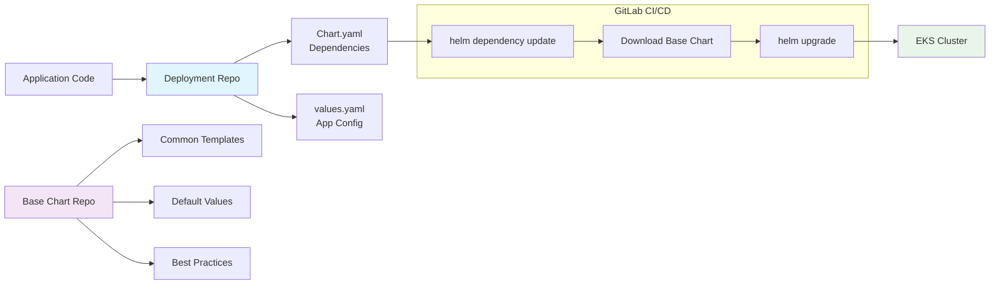
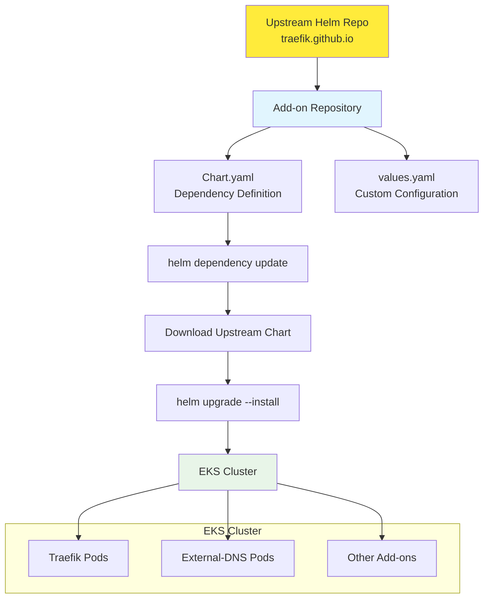
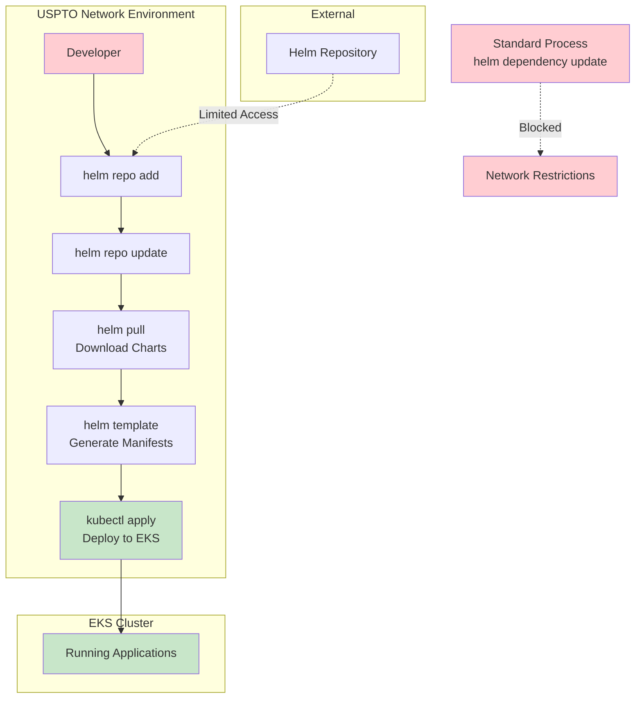

# EKS Helm Deployment Guide

## 1. Helm Introduction

Helm is a package manager for Kubernetes that simplifies the deployment and management of applications. It uses a packaging format called "charts" which are collections of files that describe a related set of Kubernetes resources.

### Key Concepts

**Helm Chart**: A collection of files that describe Kubernetes resources. Charts can be thought of as Kubernetes YAML manifests with templating capabilities.

**Values**: Configuration parameters that can be injected into chart templates to customize deployments for different environments.

**Release**: An instance of a chart running in a Kubernetes cluster. Each time you install a chart, a new release is created.

**Repository**: A place where charts can be collected and shared, similar to package repositories in other ecosystems.

### Benefits of Using Helm

- **Templating**: Reuse charts across different environments with different configurations
- **Dependency Management**: Charts can depend on other charts, enabling modular deployments
- **Release Management**: Easy upgrades, rollbacks, and release history tracking
- **Package Distribution**: Share and distribute applications as packaged charts



## 2. Helm Base Chart Strategy

Our organization employs a base chart strategy to standardize application deployments across the EKS cluster. This approach promotes consistency, reduces duplication, and simplifies maintenance.

### Architecture Overview

We maintain a **base helm chart** that contains common configurations and best practices for deploying applications in our EKS environment. Individual applications use **deployment repositories** that reference this base chart as a dependency.

### Deployment Repository Structure

Each application has its own deployment repository containing:

```
deployment-repo/
├── Chart.yaml          # Chart metadata and dependencies
├── values.yaml         # Application-specific configuration
└── templates/          # Optional: Application-specific templates
```

### Chart.yaml Example

```yaml
apiVersion: v2
name: my-application
description: Application deployment chart
type: application
version: 1.0.0
appVersion: "1.0.0"

dependencies:
  - name: base-chart
    version: "2.1.0"
    repository: "https://our-internal-helm-repo.com"
```

### GitLab CI/CD Pipeline

Our standard deployment process follows these stages:

1. **Dependency Update**: Download and update chart dependencies
2. **Helm Upgrade**: Deploy or upgrade the application release

```yaml
# .gitlab-ci.yml
stages:
  - deploy

deploy:
  stage: deploy
  script:
    - helm dependency update
    - helm upgrade --install ${RELEASE_NAME} . -f values.yaml -n ${NAMESPACE}
```



### Benefits of Base Chart Strategy

- **Standardization**: Consistent deployment patterns across all applications
- **Maintenance**: Updates to common configurations happen in one place
- **Compliance**: Built-in security and operational best practices
- **Developer Experience**: Simplified application-specific configurations

## 3. EKS Add-on Installation Using Helm Charts

Our EKS cluster requires various add-ons to provide essential services like ingress control, DNS management, and monitoring. We manage these add-ons using dedicated Helm repositories.

### Current Add-ons

**Traefik**: Ingress controller for routing external traffic to applications
**External-DNS**: Automatically manages DNS records for services

### Add-on Repository Structure

Each add-on has its own repository with:

```
addon-repo/
├── Chart.yaml          # References upstream chart
├── values.yaml         # Environment-specific configuration
└── README.md           # Documentation
```

### Standard Installation Process

```yaml
# Chart.yaml for Traefik add-on
apiVersion: v2
name: traefik-addon
description: Traefik ingress controller for EKS
type: application
version: 1.0.0

dependencies:
  - name: traefik
    version: "35.2.0"
    repository: "https://traefik.github.io/charts"
```

### Deployment Commands

```bash
# Update dependencies
helm dependency update

# Install or upgrade the add-on
helm upgrade --install traefik . -f values.yaml -n traefik-system --create-namespace
```



### Add-on Management Benefits

- **Version Control**: Track add-on versions and configurations in Git
- **Environment Consistency**: Same add-on versions across dev/staging/prod
- **Rollback Capability**: Easy rollback to previous add-on versions
- **Configuration Management**: Centralized add-on configuration

## 4. USPTO Network Challenge & Workaround

### The Challenge

When operating from the USPTO network environment, we encounter connectivity issues that prevent the standard `helm dependency update` command from functioning properly. This blocks our standard deployment pipeline and requires alternative approaches.

### Root Cause

The `helm dependency update` command requires outbound internet connectivity to download chart dependencies from external repositories. USPTO network restrictions prevent this direct connectivity.

### Workaround Solution

We've developed a manual process that bypasses the dependency update mechanism by pre-downloading charts and generating static manifests.

#### Step-by-Step Workaround Process

```bash
# 1. Add the required Helm repository
helm repo add traefik https://traefik.github.io/charts

# 2. Update repository index
helm repo update

# 3. Create local charts directory
mkdir charts/

# 4. Download the specific chart version locally
helm pull traefik/traefik --version 35.2.0 --destination charts/

# 5. Generate Kubernetes manifests from the chart
helm template my-release-name . --values values.yaml > manifest.yaml

# 6. Apply the generated manifests directly
kubectl apply -f manifest.yaml
```

#### Alternative Approach for Applications

For application deployments that use base charts:

```bash
# Download base chart manually
helm pull our-base-chart/base-chart --version 2.1.0 --destination charts/

# Extract and prepare
cd charts/
tar -xzf base-chart-2.1.0.tgz

# Generate manifests
helm template my-app ../deployment-repo --values ../deployment-repo/values.yaml > app-manifest.yaml

# Deploy
kubectl apply -f app-manifest.yaml
```



### Limitations of Workaround

**No Helm Release Management**: Since we use `kubectl apply` instead of `helm install/upgrade`, Helm doesn't track releases or maintain deployment history

**Loss of Rollback Capability**: Without Helm release history, we cannot use `helm rollback` commands to revert to previous versions

**No Release Status Tracking**: Cannot use `helm status` or `helm list` to monitor deployment states and health

**Manual Rollback Process**: Rollbacks require manual recreation of previous manifest versions and reapplication via `kubectl`

### Recommendations

1. **Network Policy Review**: Work with network team to allow selective outbound access to trusted Helm repositories
2. **Internal Mirror**: Set up an internal Helm repository mirror within the USPTO network
3. **Automation Scripts**: Create scripts to automate the workaround process
4. **CI/CD Adaptation**: Modify GitLab CI/CD pipelines to accommodate the workaround when detecting USPTO network environment

### Future Improvements

- Implement network-aware CI/CD pipelines that automatically detect environment and choose appropriate deployment method
- Establish internal Helm repository with approved charts
- Create automation tools to streamline the manual workaround process
- Document network requirements for Helm operations for infrastructure teams
