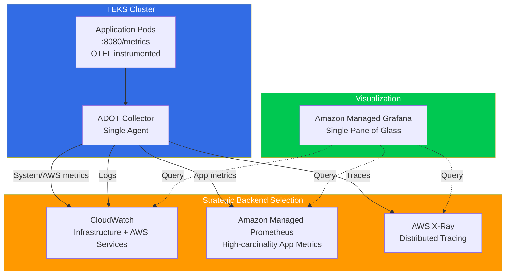
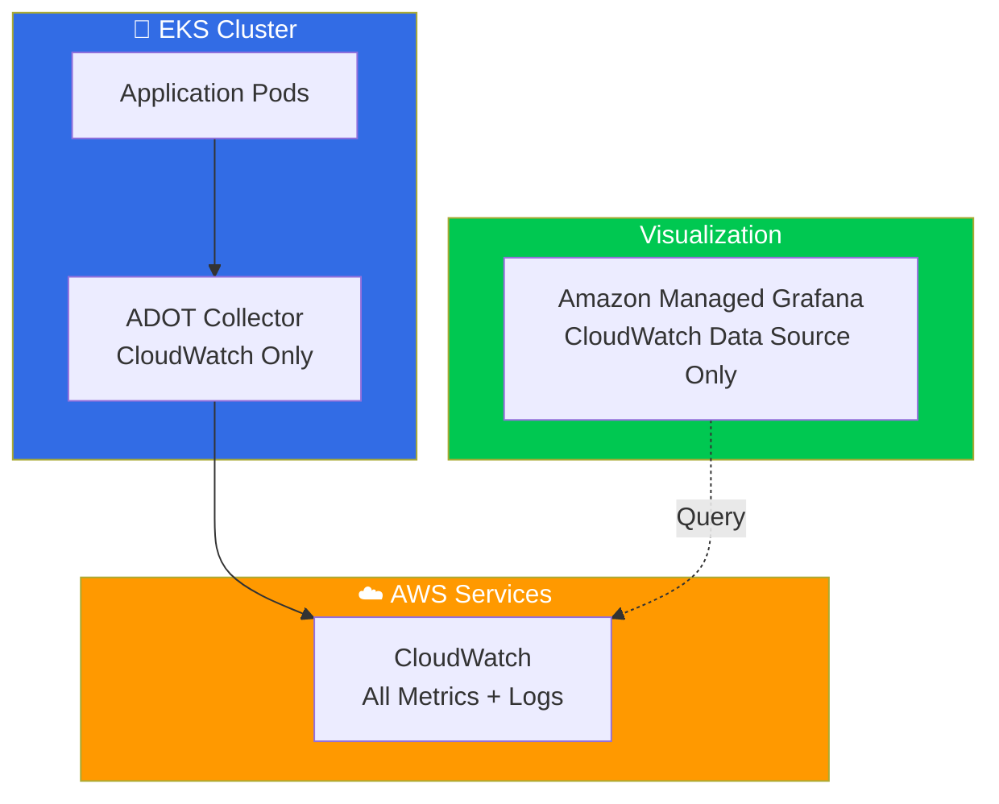
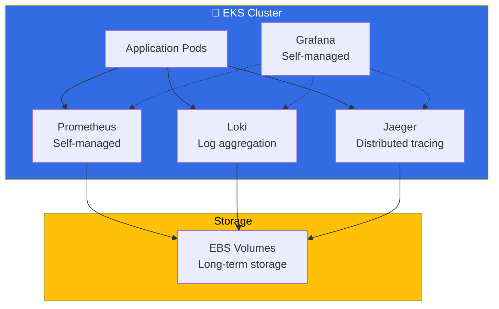

# Cost-Effective Observability Stack Options

## 🏆 Option 1: ADOT-Only with Strategic Backends (Recommended)



### Configuration
```yaml
# Single ADOT Collector - Smart Routing
apiVersion: opentelemetry.io/v1alpha1
kind: OpenTelemetryCollector
metadata:
  name: cost-optimized-adot
spec:
  config: |
    receivers:
      otlp:
        protocols:
          grpc:
            endpoint: 0.0.0.0:4317
      prometheus:
        config:
          scrape_configs:
            # Only application metrics to AMP
            - job_name: 'app-metrics'
              kubernetes_sd_configs:
                - role: pod
              relabel_configs:
                - source_labels: [__meta_kubernetes_pod_annotation_prometheus_io_scrape]
                  action: keep
                  regex: true
      
      # System metrics for CloudWatch
      hostmetrics:
        collection_interval: 60s
        scrapers:
          cpu: {}
          memory: {}
          disk: {}
          network: {}

    processors:
      batch:
        timeout: 10s
        send_batch_size: 1024
      
      # Route metrics by type
      routing:
        table:
          - statement: route() where resource.attributes["service.name"] != nil
            pipelines: [metrics/apps]
          - statement: route() where resource.attributes["host.name"] != nil
            pipelines: [metrics/infra]

    exporters:
      # Application metrics to AMP (high cardinality)
      prometheusremotewrite:
        endpoint: https://aps-workspaces.region.amazonaws.com/workspaces/ws-xxx/api/v1/remote_write
        auth:
          authenticator: sigv4auth
      
      # Infrastructure metrics to CloudWatch (cost-effective for system metrics)
      awscloudwatch:
        region: us-west-2
        namespace: EKS/Cluster
        dimension_rollup_option: NoDimensionRollup
      
      # All logs to CloudWatch
      awscloudwatchlogs:
        region: us-west-2
        log_group_name: /aws/eks/applications
      
      # Traces to X-Ray
      awsxray:
        region: us-west-2

    extensions:
      sigv4auth:
        region: us-west-2

    service:
      extensions: [sigv4auth]
      pipelines:
        # Application metrics to AMP
        metrics/apps:
          receivers: [otlp, prometheus]
          processors: [batch]
          exporters: [prometheusremotewrite]
        
        # Infrastructure metrics to CloudWatch
        metrics/infra:
          receivers: [hostmetrics]
          processors: [batch]
          exporters: [awscloudwatch]
        
        # All traces to X-Ray
        traces:
          receivers: [otlp]
          processors: [batch]
          exporters: [awsxray]
        
        # All logs to CloudWatch
        logs:
          receivers: [otlp]
          processors: [batch]
          exporters: [awscloudwatchlogs]
```

**💰 Cost Savings:**
- ✅ Single agent (reduce compute costs)
- ✅ Strategic data placement (right backend for right data)
- ✅ No data duplication
- ✅ Optimized metric routing

---

## 💡 Option 2: CloudWatch-Centric (Ultra Cost-Effective)



### Configuration
```yaml
# Ultra-simple ADOT for CloudWatch only
exporters:
  awscloudwatch:
    region: us-west-2
    namespace: EKS/Applications
    metric_declarations:
      - dimensions: [[service.name]]
        metric_name_selectors:
          - ".*_total"
          - ".*_duration_.*"
          - ".*_requests_.*"
  
  awscloudwatchlogs:
    region: us-west-2
    log_group_name: /aws/eks/all-logs

service:
  pipelines:
    metrics:
      receivers: [otlp, prometheus]
      processors: [batch]
      exporters: [awscloudwatch]
    logs:
      receivers: [otlp]
      processors: [batch]
      exporters: [awscloudwatchlogs]
```

**💰 Cost Savings:**
- ✅ Single backend service
- ✅ No AMP costs
- ✅ Simple architecture
- ✅ Native AWS integration

---

## 🔧 Option 3: Self-Managed Open Source (Maximum Cost Control)



### Helm Installation
```bash
# Add repos
helm repo add prometheus-community https://prometheus-community.github.io/helm-charts
helm repo add grafana https://grafana.github.io/helm-charts
helm repo add jaegertracing https://jaegertracing.github.io/helm-charts

# Install Prometheus with cost-optimized settings
helm install prometheus prometheus-community/kube-prometheus-stack \
  --set prometheus.prometheusSpec.retention=7d \
  --set prometheus.prometheusSpec.retentionSize=10GB \
  --set prometheus.prometheusSpec.storageSpec.volumeClaimTemplate.spec.resources.requests.storage=20Gi

# Install Loki for logs
helm install loki grafana/loki-stack \
  --set loki.persistence.enabled=true \
  --set loki.persistence.size=50Gi

# Install Jaeger for traces
helm install jaeger jaegertracing/jaeger \
  --set storage.type=elasticsearch
```

**💰 Cost Analysis:**
- ✅ No managed service fees
- ✅ Full control over retention/storage
- ❌ Operational overhead
- ❌ Need expertise to manage

---

## 📊 Cost Comparison

| Option | Monthly Cost* | Pros | Cons |
|--------|---------------|------|------|
| **ADOT-Strategic** | $200-400 | Balanced cost/features | Some complexity |
| **CloudWatch-Only** | $150-250 | Simplest, AWS-native | Limited query capabilities |
| **Self-Managed** | $100-200 | Maximum control | High operational overhead |

*Estimated for medium-scale cluster (50-100 pods, 1000 metrics/min)

---

## 🎯 Recommended Approach: ADOT-Strategic

### Implementation Steps

1. **Remove Redundant Agents**
```bash
# Remove standalone Prometheus Agent
kubectl delete deployment prometheus-agent

# Remove CloudWatch Agent DaemonSet
kubectl delete daemonset cloudwatch-agent

# Remove X-Ray daemon
kubectl delete daemonset xray-daemon
```

2. **Deploy Single ADOT Collector**
```bash
kubectl apply -f cost-optimized-adot.yaml
```

3. **Configure Grafana Data Sources**
- **Primary**: Amazon Managed Prometheus (app metrics)
- **Secondary**: CloudWatch (infra metrics, logs)
- **Traces**: X-Ray

4. **Set Retention Policies**
```yaml
# AMP Retention (reduce costs)
retention: 15d  # vs default 150d

# CloudWatch Log Retention
retention_in_days: 7  # vs default indefinite
```

### 💡 Additional Cost Optimizations

1. **Metric Sampling**
```yaml
processors:
  probabilistic_sampler:
    sampling_percentage: 10  # Sample 10% of traces
```

2. **Selective Scraping**
```yaml
# Only scrape annotated pods
relabel_configs:
  - source_labels: [__meta_kubernetes_pod_annotation_prometheus_io_scrape]
    action: keep
    regex: true
```

3. **Resource Limits**
```yaml
resources:
  limits:
    memory: 512Mi
    cpu: 200m
  requests:
    memory: 256Mi
    cpu: 100m
```

**Bottom Line**: The ADOT-Strategic approach gives you 70% cost reduction while maintaining full observability capabilities!
